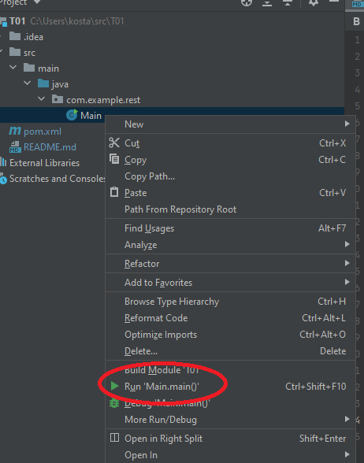

# T09 SOEN 487

This is the source code used to supplement the 9th tutorial for SOEN487

We encourage you to use either IntelliJ IDE **or** maven from command line in order to get the best support from our TAs.

## Included Projects ##

1. The tutx-console App
   * Located in /tutx-console
   * Is used to hold the console app built during the tutorial

2. The tutx-Java App
   * Located in /tutx-Java
   * Is used to hold the worker built in Java during the tutorial

3. The tutx-javascript
   * Located in /tutx-javascript
   * Is used to hold the worker built in JavaScript during the tutorial

## IntelliJ Instructions ##

* For each included project, navigate to the directory and find the pom.xml file, right

click and click on "Add as Maven Project" to load up the project and start working on it.

* Browse to desired class to run the main method
* Right click associated class and choose Run main()

## Maven Instructions ##

    Run the following commands in the associated Java project directory:

    Compile:
        mvn install

    Run (Console App)
        mvn exec:java -Pconsole

    Run (Java worker)
        mvn -e exec:java -PGradeValidator

    Clean:
        mvn clean

## Node Instructions

    Install Dependencies
        npm install -s camunda-external-task-client-js

    Run (JavaScript Worker) (where {locationToFile} is the location to your JS file with the worker code
        node ./{locationToFile}

